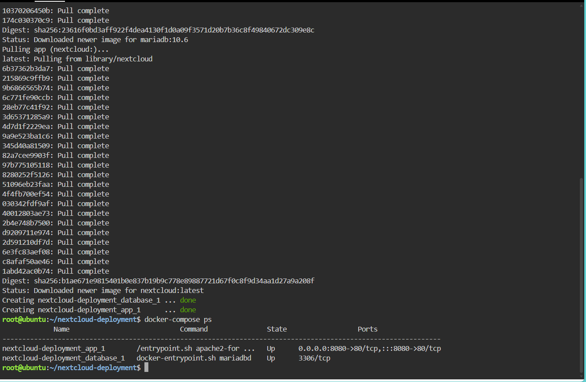
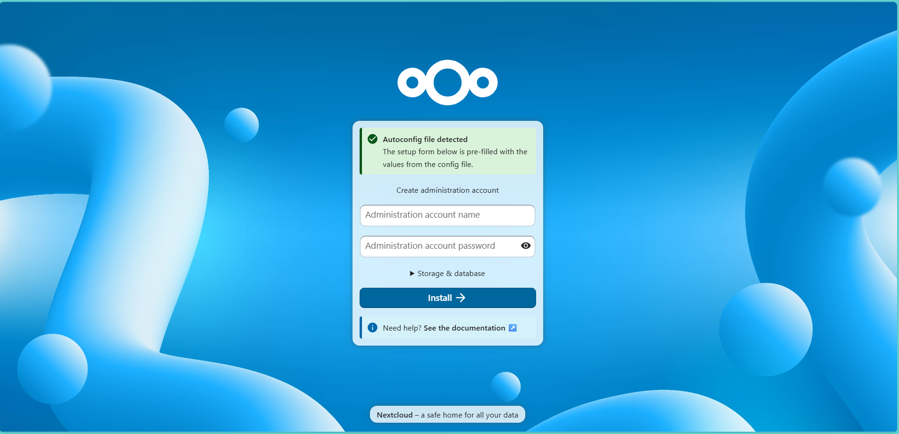
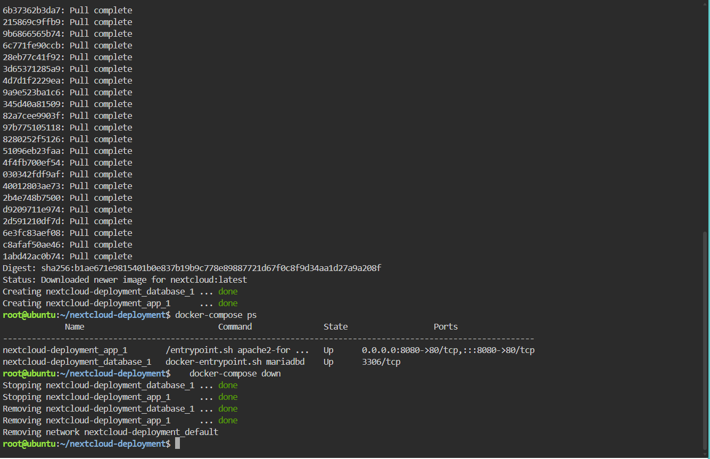

# Laboratory 06 - Cloud Deployment Engineer

## Mission Overview

In this mission, I worked as a Cloud Deployment Engineer at CloudNova Technologies. The task was to deploy a proof-of-concept private cloud storage system for a university client using Nextcloud. Because Nextcloud needs a database, I built a two-tier architecture with a Nextcloud web container and a MariaDB database container. I defined both in a `docker-compose.yml` file and deployed the whole stack with a single command, following Infrastructure as Code (IaC) principles.

## Objectives

- Explain the concept of a multi-tier application architecture.
- Understand the purpose and structure of a `docker-compose.yml` file.
- Use the Linux text editor `nano` to create configuration files.
- Deploy a multi-container application (Nextcloud + MariaDB) using Docker Compose.
- Document deployment procedures and IaC principles using Markdown.
- Continue expanding my GitHub Cloud Computing Portfolio.

## Commands Executed

| Command | Purpose |
|---|---|
| `mkdir nextcloud-deployment` | Created a new project directory |
| `cd nextcloud-deployment` | Moved into the project directory |
| `nano docker-compose.yml` | Created the Compose file using the nano editor |
| `docker-compose up -d` | Pulled the images and started both containers in the background |
| `docker-compose ps` | Verified that both containers were running |
| `docker-compose down` | Stopped and removed the containers and network |

## Screenshots

### Deployment and running containers

### Nextcloud setup page (port 8080)

### Teardown

## Skills Learned

- Explaining the roles of the web/application tier and the database tier.
- Writing a valid, space-indented YAML configuration file.
- Using `nano` to create and save files in the terminal.
- Deploying and tearing down a multi-container stack with Docker Compose.
- Connecting containers through service names and environment variables.
- Accessing a containerized app through a mapped port (8080:80).
- Documenting infrastructure and deployment steps in Markdown.

## Related Files

- [multi-tier-architecture.md](multi-tier-architecture.md)
- [docker-compose-guide.md](docker-compose-guide.md)
- [reflection.md](reflection.md)
